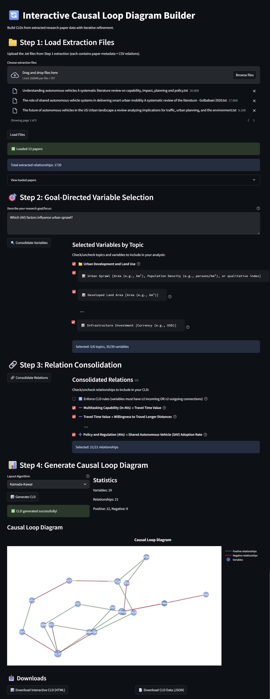

# Paper to CLD 📜→🔄
_Extract causal relationships from research literature and build focused system diagrams in minutes, not months._

Paper to CLD bridges the gap between academic literature and systems thinking by automatically extracting causal relationships from PDF research papers and synthesizing them into focused, interactive causal loop diagrams. The tool uses large language models to identify explicit causal claims across multiple papers, then applies goal-directed filtering to surface only the relationships relevant to your specific research question. Through an iterative web interface, researchers can refine variable selections, validate relationships, and generate publication-ready diagrams that trace back to original sources, making compl

## Contribute
This project is very experimental and in early stages of development. All ideas, feedback, and contributions are welcome!



## Problem and motivation
Understanding complex systems often requires synthesizing causal relationships from multiple research sources. Traditional approaches to building causal loop diagrams are time-intensive and rely heavily on manual extraction and synthesis of relationships from literature. This creates barriers to developing comprehensive system models, particularly when dealing with large volumes of research papers.

The challenge becomes even greater when trying to focus the analysis on specific research goals or outcomes. Researchers need tools that can intelligently filter and prioritize causal relationships based on their specific research objectives, while maintaining scientific rigor and traceability to original sources.

## Conceptual design
The tool follows a three-stage pipeline that progressively refines raw research data into focused, interactive causal models:

- **Stage 1: Automated Extraction** uses large language models to systematically extract causal relationships from PDF research papers. The extraction process specifically targets explicit causal language and experimental results, avoiding mere correlations. Each paper yields structured metadata and a CSV of causal relationships with supporting evidence.
- **Stage 2: Goal-Directed Consolidation** takes the extracted relationships and applies intelligent filtering based on user-defined research goals. The system identifies the most relevant variables for the specific research objective, organizes them thematically, and consolidates similar relationships across papers while resolving conflicts. This stage reduces information overload by focusing only on relationships pertinent to the research question.
- **Stage 3: Interactive Visualization** generates both static and interactive causal loop diagrams from the consolidated relationships. The system automatically detects feedback loops, calculates network metrics, and provides multiple layout algorithms. Users can iteratively refine their diagrams by selecting or deselecting specific variables and relationships.

The design allows humans to stay in the loop. While AI handles the heavy lifting of extraction and initial consolidation, researchers maintain control over variable selection, relationship validation, and final diagram composition. This ensures domain expertise guides the analysis while leveraging AI capabilities for efficiency.

**Interactive Web Interface** (via Streamlit) allows researchers to upload extraction files, define research goals, review AI-generated variable selections, manually refine relationship sets, and generate publication-ready diagrams. The interface supports iterative refinement, enabling researchers to experiment with different variable combinations and immediately see the impact on their causal models.

## Key features

- Automated extraction of causal relationships from PDF research papers using Google's Gemini API
- Goal-directed filtering that focuses analysis on variables relevant to specific research objectives  
- Hierarchical variable organization by thematic topics for better conceptual clarity
- Interactive relationship validation with manual override capabilities
- Multiple network layout algorithms optimized for different analysis needs
- Automatic feedback loop detection with classification (reinforcing vs. balancing)
- Export capabilities for both interactive HTML diagrams and structured JSON data
- Full traceability from final diagram elements back to original paper sources

## Technical implementation
The system consists of four main components: extraction scripts that process PDF files through the Gemini API, consolidation logic that merges and filters relationships using LLM-assisted analysis, visualization engines built on NetworkX and Plotly for interactive diagrams, and a Streamlit web interface that orchestrates the entire workflow while providing real-time feedback and refinement capabilities.

The modular design allows researchers to use individual components independently or run the complete pipeline. All intermediate outputs are preserved, enabling reproducibility and iterative analysis refinement.

## Installation

```bash
pip install google-genai python-dotenv networkx plotly pandas matplotlib streamlit kaleido
```

Set your Google Gemini API key:
```bash
export GEMINI_API_KEY="your_api_key_here"
```

## Quick start

**Command line usage:**
```bash
# Extract relationships from PDFs
python step1_extract.py

# Consolidate relationships with goal focus
python step2_consolidate.py

# Generate causal loop diagrams
python step3_generate_cld.py
```

**Interactive web interface:**
```bash
streamlit run streamlit_app.py
```

Upload your extraction files, define your research goal, and iteratively build your CLD through the web interface.

## Usage

The tool processes research papers through three stages:

1. **Extract** (`step1_extract.py`): Point to a folder of PDF papers. The system extracts causal relationships and saves them as structured text files.
2. **Consolidate** (`step2_consolidate.py`): Define your research goal and let the AI select relevant variables and merge similar relationships across papers.
3. **Visualize** (`step3_generate_cld.py`): Generate interactive and static causal loop diagrams with automatic feedback loop detection.

Alternatively, use the Streamlit interface for an integrated workflow with real-time refinement capabilities.

## Output files

- `step1_extractions/`: Individual paper extractions with metadata and relationships
- `step2_consolidated_relations.json`: Goal-filtered variables and consolidated relationships  
- `step3_interactive_cld.html`: Interactive Plotly diagram
- `step3_static_cld.png`: Publication-ready static diagram
- `step3_feedback_loops.json`: Detected feedback loops analysis

## Requirements
- Python 3.10+
- Google Gemini API key
- PDF research papers as input
